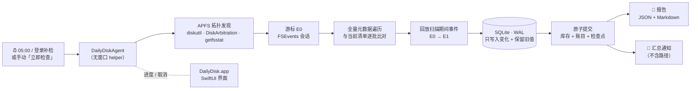

<!--
  官网尚未上线：下面的 https://dailydisk.app 是预留域名占位，上线后全局替换即可。
  宣传片：assets/dailydisk-film.mp4（30 秒，1080p）。
-->

<div align="center">


# DailyDisk

**磁盘每天长了多少，都记在哪儿。**<br>
<sub>A daily, privacy-first disk-growth ledger for macOS: which files grew, by how much, and what can't be explained.</sub>

<p>
  <a href="https://github.com/Nu1sance/DailyDisk/releases/latest"></a>
  <a href="https://github.com/Nu1sance/homebrew-tap"></a>
  
  
  
  <a href="https://github.com/Nu1sance/DailyDisk/actions/workflows/ci.yml"></a>
  <a href="https://github.com/Nu1sance/DailyDisk/blob/main/LICENSE"></a>
</p>

<p>
  <a href="https://github.com/Nu1sance/DailyDisk/releases/latest"><b>⬇️ 下载</b></a> ·
  <a href="https://dailydisk.app"><b>🌐 官网</b></a> ·
  <a href="assets/dailydisk-film.mp4"><b>🎬 宣传片</b></a> ·
  <a href="#-安装"><b>🚀 安装</b></a> ·
  <a href="#-更新"><b>🔄 更新</b></a> ·
  <a href="#-工作原理"><b>🧠 工作原理</b></a> ·
  <a href="#-文档"><b>📚 文档</b></a>
</p>

<sub>🌐 官网即将上线 · Website coming soon</sub>

<br>

<a href="assets/dailydisk-film.mp4">
  
</a>

<sub>“空间，不会凭空消失。它只是在某个角落。每一次增长，都有名字。”<br>
30 秒 · 1080p · 画面与配乐均由代码实时生成 · <a href="assets/dailydisk-film.mp4">▶ 观看完整影片（MP4，13 MB）</a></sub>

</div>

<br>

> [!NOTE]
> 第一次完整扫描只是**期初余额**，不会把已有文件当作“新增”。从下一次成功检查开始，DailyDisk 才会给出真正的增长账单。

## ✨ 为什么是 DailyDisk

磁盘分析工具大多回答“**现在**什么占了空间”。DailyDisk 回答的是另一个问题：“**从上次到现在**，空间去了哪儿？”

<table>
<tr>
<td width="50%" valign="top">

### 📈 每日增长账单
每天 05:00 自动做一次完整元数据检查，与上一份清单直接比对，列出增长最多的文件与目录，以及释放了空间的位置。当天再次手动检查会尝试增量处理。

</td>
<td width="50%" valign="top">

### 🧾 带符号的诚实账目
每日比对、事件归属和对账校正分开记账；APFS 解释不了的部分单列为“未归因”，**绝不编造路径**。

</td>
</tr>
<tr>
<td valign="top">

### 🔄 应用内更新，历史不丢
点击 **检查更新…** 即可下载安装新版本。安装期间自动暂停扫描，新版本启动后恢复每日任务，基线和报告原样保留。

</td>
<td valign="top">

### 🍺 下载、Homebrew 或源码
经 Apple 公证的 Apple Silicon 安装包（DMG / ZIP）、一行 `brew install`，或从源码构建，任选其一。

</td>
</tr>
<tr>
<td valign="top">

### 🔐 本机、私密、无遥测
扫描不发出任何网络请求，只有点击“检查更新…”时才连接更新源。通知、日志和默认 CLI 输出都不含完整路径。

</td>
<td valign="top">

### 🪶 轻量后台，不常驻
后台 helper 按需启动，扫描完成后立即退出。不需要 root、`sudo`、LaunchDaemon，也不会因为失败无限重试。

</td>
</tr>
<tr>
<td valign="top">

### 👀 进度真实可见
显示阶段、计数、耗时和最后更新时间，不伪造百分比。关掉窗口扫描也会继续，重新打开会自动接上进度。保存开始前都可以安全取消。

</td>
<td valign="top">

### 🧹 只写变化，自身占用可回收
每日检查复用未变化的记录，只写入差异。数据库可在 **设置 → 诊断** 中一键回收空间，不影响基线和历史报告。

</td>
</tr>
</table>

## 🖥 界面一览

| 区域 | 内容 |
| --- | --- |
| **概览** | 最新物理增长、**空间构成卡片**（文件净变化 + 未归因 + DailyDisk 自身开销）、最多 5 项增长与 5 项释放来源，以及最近 14 次检查的增长柱状图（悬停可看每次的时间与变化） |
| **历史** | 按日期、运行和存储域浏览报告，查看核算、覆盖范围、物理诊断、完整排名和错误；工具栏显示路径状态，并提供路径显示与 JSON 导出 |
| **设置** | **通用**（软件更新、每日任务、通知、高级操作、本地数据、重置）· **磁盘权限**（完全磁盘访问引导）· **诊断**（验证数据库、数据占用与空间回收、最近运行、复制脱敏诊断） |

界面采用 “Graphite” 风格：中性的系统表面，只用一种靛蓝强调色，同时支持浅色和深色模式。

## 🚀 安装

> [!IMPORTANT]
> 适用于 **macOS 15+**、使用**内置 APFS 启动盘**的 Mac。正式安装包与 Homebrew 面向 **Apple Silicon**；外置硬盘和网络磁盘默认不检查。请只保留**一份**日常使用的应用。

<table>
<tr><th>⬇️ 下载安装包（推荐）</th><th>🍺 Homebrew</th></tr>
<tr>
<td valign="top" width="50%">

从 **[最新正式版](https://github.com/Nu1sance/DailyDisk/releases/latest)** 下载 Apple Silicon 安装包（DMG 或 ZIP），把 DailyDisk 拖进“应用程序”。

正式版 **0.2.2（构建 17）** 已签名并通过 Apple 公证。首次打开时 macOS 仍可能请你确认下载来源。

</td>
<td valign="top" width="50%">

```bash
brew install --cask nu1sance/tap/dailydisk
```

默认装到 `/Applications`；没有写入权限时追加 `--appdir="$HOME/Applications"`，**不要用 sudo**。[详细说明](https://github.com/Nu1sance/DailyDisk/blob/main/Docs/Homebrew.md)

</td>
</tr>
</table>

**首次设置**：概览页的工具栏始终只给出一个当前应做的主操作。

1. **允许读取磁盘**：在“系统设置 → 隐私与安全性 → 完全磁盘访问权限”中添加已安装的 DailyDisk（通常是 `/Applications/DailyDisk.app`），然后退出并重新打开应用。
2. **启用每日检查**：注册后台 helper。如果 macOS 需要批准，按钮会变成 **允许后台检查**，并打开“登录项与扩展”。
3. **开始首次检查**：建立期初基线。之后可以随时点 **立即检查**。通知可在 **设置 → 通用** 中按需开启。

> [!TIP]
> 想快速验证效果？基线完成后运行 `mkdir -p ~/Downloads/DailyDisk-Test && mkfile 2g ~/Downloads/DailyDisk-Test/growth-test.bin`，再点 **立即检查**，“历史”里应该能看到约 2 GB 的增长归到这个路径。测试完记得删除。

<details>
<summary><b>🛠 从源码构建</b></summary>

需要 Apple 命令行工具或完整 Xcode（Swift 6+、macOS 15+ SDK）。不需要 Python、Node.js、Docker 或数据库服务器。

```bash
xcode-select --install
git clone https://github.com/Nu1sance/DailyDisk.git
cd DailyDisk
```

| 🧪 一次性试用（ad-hoc 签名） | 📌 长期使用（Apple 签发的签名身份） |
| --- | --- |
| `ALLOW_ADHOC_SIGNING=1 Scripts/build-app.sh --install` | `CODE_SIGN_IDENTITY="Apple Development: Your Name (TEAMID)" Scripts/build-app.sh --install` |
| 重新构建后可能需要重新授予权限 | 内嵌更新框架需要带 Team ID 的身份；不带 Team ID 的本地自签名证书已不再适用 |

- 默认安装到 `/Applications`；加 `--user` 装到 `~/Applications`，`--debug` 为调试构建。
- 每次更新保持**同一个**签名身份、bundle ID 和安装路径。
- 源码构建默认不配置更新源，“检查更新…”会提示未配置；请按[手动替换](#-更新)流程更新。

完整说明见 [Docs/Installation.md](https://github.com/Nu1sance/DailyDisk/blob/main/Docs/Installation.md)。
</details>

## 🔄 更新

| 方式 | 怎么做 |
| --- | --- |
| **应用内更新**（推荐） | **设置 → 软件更新** 或应用菜单中点 **检查更新…**。只在你点击时检查，不在后台自动下载 |
| **Homebrew** | 先在 **设置 → 通用 → 高级操作** 点 **暂停运行以手动替换应用** 并退出，再运行 `brew upgrade --cask nu1sance/tap/dailydisk`，重新打开后点 **恢复运行** |
| **手动替换 / 源码** | 同样先 **暂停运行以手动替换应用**，替换后点 **恢复运行**（无论替换成功还是放弃） |

- 安装前会确认没有检查在运行，然后暂停扫描、记住每日任务状态并暂时移除它；新版本启动后恢复原有设置。
- 更新只替换当前位置的应用，数据库与历史报告留在本机原目录：**不重置、不重新建立基线**。
- 安装被中断时扫描保持暂停，重新打开 **检查更新…** 完成待安装的更新即可。有其他用户同时登录时，更新会被拒绝。
- Homebrew 不会用旧版覆盖应用内已更新到的新版本。

## 🧠 工作原理



<details>
<summary><b>核算公式</b>：所有差值都是带符号的 <code>Int64</code> 字节数</summary>

```text
reconciledIndexedDelta    = snapshotComparedDelta
                          + eventAttributedDelta
                          + reconciliationCorrection

physicalUnattributedDelta = physicalUsedDelta
                          - reconciledIndexedDelta
                          - dailyDiskOverheadDelta
```

- **`snapshotComparedDelta`**：每日完整检查与上一份清单直接比对得出的变化，不算作事件归属或对账误差。
- **`eventAttributedDelta`**：当天增量检查中由文件事件归属到路径的变化。
- **正的校正**：全量扫描发现了事件维护遗漏的已分配空间；**负的校正**：增量索引里还记着已经不存在的空间。
- **未归因**：APFS 克隆、共享 extent、快照、元数据、可清除空间、不可读内容以及已删除但仍被打开的文件，都会让逐文件的物理占用无法精确计算。这一部分单独列出，绝不硬塞给某个路径。
- 硬链接按“卷 / 设备 / inode”只归属到一条规范路径，不会重复计算。

详见 [Docs/Accounting.md](https://github.com/Nu1sance/DailyDisk/blob/main/Docs/Accounting.md)。
</details>

<details>
<summary><b>扫描边界与可信事件</b></summary>

- 只对当前启动的 Data 卷（`/System/Volumes/Data`）做完整库存；封装的 System 卷和其他 APFS 角色只记录卷级指标。
- 外置、可移除、网络、光盘和磁盘映像卷默认排除。
- 使用 `fstatat` / `openat`（`AT_SYMLINK_NOFOLLOW`、`O_NOFOLLOW`）逐目录遍历，不跟随符号链接，也不跨越嵌套挂载点。
- 事件丢失或回绕、日志 UUID 变化、挂载变化、根目录替换，或无法消歧的 inode 复用，都会触发权威的全量恢复，绝不推进不可信的检查点。
- 不可读的子树会保留上一次的库存，不会被当作“删除”。

详见 [Docs/Architecture.md](https://github.com/Nu1sance/DailyDisk/blob/main/Docs/Architecture.md) 和 [Docs/DailyFullScan.md](https://github.com/Nu1sance/DailyDisk/blob/main/Docs/DailyFullScan.md)。
</details>

<details>
<summary><b>每日全量与手动检查规则</b></summary>

- 每个本地日在 **05:00** 自动做一次全量检查；当天已有成功发布的全量报告就跳过。
- 当天还没有全量结果时，手动 **立即检查** 会执行全量；之后的手动请求先尝试增量，事件历史不可信时自动回退到全量。
- 判断“当天完成”依据的是提交后的实际完成时间和已发布的报告，不看开始时间。
- 已关机或已注销的 Mac 无法执行用户任务；补检依赖之后的登录或唤醒，不保证一定会被唤醒执行。
</details>

## 🧰 命令行（自动化与专家诊断）

日常操作都可以在应用里完成。`dailydiskctl` 用于自动化、严格只读的检查，以及依赖退出码的脚本：

```bash
CLI="/Applications/DailyDisk.app/Contents/Helpers/dailydiskctl"   # 装在 ~/Applications 时相应替换

"$CLI" version && "$CLI" build-number
"$CLI" status
"$CLI" history --limit 14
"$CLI" report
"$CLI" verify        # 0 健康 · 2 数据库异常
"$CLI" diagnostics
```

默认不显示路径。需要路径时必须显式同意：

```bash
"$CLI" report --include-paths
"$CLI" report --include-paths --json          # JSON 含可还原路径，必须同时加 --include-paths
"$CLI" report --run <run-uuid> --domain <container-uuid>
```

<details>
<summary>退出码</summary>

| 码 | 含义 |
| --- | --- |
| `0` | 成功 / 校验健康 |
| `2` | 校验发现数据库不健康 |
| `64` | 用法错误 |
| `65` | 数据损坏或无效 |
| `66` | 数据库或报告不存在 |

严格模式下，若写入进程正在运行或 WAL 非空，CLI 会拒绝读取，避免读到过期数据。等 helper 退出后重试即可。
</details>

## 🔒 数据与隐私

```text
~/Library/Application Support/DailyDisk/
├── DailyDisk.sqlite        # 私有库存、账目与报告索引（WAL）
├── Reports/<run-uuid>/     # report.json + report.md（包含详细路径，仅本人可读）
├── Logs/                   # 无路径的运行日志
├── AlertState.json
└── Control/                # 0700：请求 / 进度 / 取消 / 更新协调，固定结构，无路径
```

- 扫描不联网，没有云端存储，没有遥测；只有手动“检查更新…”时才连接更新源。
- 通知只包含汇总字节数；日志使用类型化的公开字段，敏感字符串会做哈希。
- 界面中的路径只在当前会话里明确选择后显示；导出完整 JSON 需要再次确认。

更多内容见 [SECURITY.md](https://github.com/Nu1sance/DailyDisk/blob/main/SECURITY.md)。

## 🧹 维护、卸载与重置

- **回收自身占用**：打开 **设置 → 诊断 → 数据占用**，点 **回收数据库空间**，由后台 helper 整理数据库；基线和历史报告会保留。需要约两倍数据库大小再加 1 GB 的可用空间，开始后不可取消。自动压缩有空间阈值和七天冷却期。
- **卸载**：**设置 → 移除每日任务** →（可选）**设置 → 重置历史与基线…** → 退出应用 → 删除 `/Applications/DailyDisk.app`（Homebrew 安装的运行 `brew uninstall --cask nu1sance/tap/dailydisk`）→ 在系统设置中移除“完全磁盘访问权限”和“通知”里残留的条目。
- Homebrew 卸载只移除应用，**保留**历史数据。

> [!WARNING]
> 删除历史会同时删除基线，之后就无法再解释相对上一次的变化。

## ⚠️ 已知限制

- 完全磁盘访问权限不会绕过 POSIX 权限、ACL、SIP 或签名系统卷。
- FSEvents 是会合并事件的变化日志，不是审计日志。在两次检查之间创建后又删除的文件无法还原，除非它们仍通过打开的文件描述符或快照占用空间。
- “已删除但仍打开”的文件大小只是逻辑上的证据，不一定等于 APFS 中独占的块。
- 快照大小字段是可选的，不会被直接相加。
- 正式安装包与 Homebrew 仅面向 Apple Silicon；Intel、全新 Mac、标准用户账户与自定义 Homebrew 前缀尚未完整验证，也没有通用二进制。
- 更新采用单用户策略：有其他用户登录时请先让其退出登录。

## 🛠 开发

```bash
swift format lint --recursive Sources App Tests
swift build
swift test
Scripts/lint-launch-agent.sh
ALLOW_ADHOC_SIGNING=1 Scripts/build-app.sh
DAILYDISK_DRY_RUN=1 build/DailyDisk.app/Contents/Helpers/DailyDiskAgent   # 期望退出码 0
```

百万行压力测试需要显式开启（也可以通过手动触发的 GitHub 工作流运行）：

```bash
DAILYDISK_RUN_STRESS=1 swift test --filter millionRecordInventory
```

<details>
<summary>仓库结构</summary>

```text
App/DailyDisk/          SwiftUI 前台应用（含 Sparkle 更新）
App/DailyDiskAgent/     无窗口的定时 helper
Sources/DailyDiskCore/      模型、核算、策略、协调器、产品版本
Sources/DailyDiskStore/     SQLite schema、迁移、generation、报告
Sources/DailyDiskPlatform/  APFS、FSEvents、扫描器、launchd、通知、安装协调
Sources/dailydiskctl/       严格只读 CLI
Scripts/                构建、安装、更新配置与 Homebrew 工具
Tests/                  Core / Store / Platform / App / CLI / 集成 / 性能
```

一个构建好的应用包里有三个各自签名的可执行文件：`Contents/MacOS/DailyDisk`、`Contents/Helpers/DailyDiskAgent`、`Contents/Helpers/dailydiskctl`。
</details>

提交 PR 前请先阅读 [CONTRIBUTING.md](https://github.com/Nu1sance/DailyDisk/blob/main/CONTRIBUTING.md) 中必须保持的不变量。

## 📚 文档

| 文档 | 内容 |
| --- | --- |
| [用户文档](docs.html) | 下载与 Homebrew 安装、首次设置、日常使用、读懂报告、更新、卸载与排障（中文） |
| [Installation](https://github.com/Nu1sance/DailyDisk/blob/main/Docs/Installation.md) | 源码安装、签名、Sparkle 更新与安装位置 |
| [Homebrew](https://github.com/Nu1sance/DailyDisk/blob/main/Docs/Homebrew.md) | Homebrew 安装、升级、卸载与中断恢复 |
| [Architecture](https://github.com/Nu1sance/DailyDisk/blob/main/Docs/Architecture.md) | 子系统划分与扫描边界设计 |
| [Accounting](https://github.com/Nu1sance/DailyDisk/blob/main/Docs/Accounting.md) | 带符号的核算公式 |
| [DailyFullScan](https://github.com/Nu1sance/DailyDisk/blob/main/Docs/DailyFullScan.md) | 每日全量与 W6 持久化 |
| [Database](https://github.com/Nu1sance/DailyDisk/blob/main/Docs/Database.md) | SQLite generation、overlay、封存与恢复 |
| [Operations](https://github.com/Nu1sance/DailyDisk/blob/main/Docs/Operations.md) | 定时流程、维护与排障 |
| [Testing](https://github.com/Nu1sance/DailyDisk/blob/main/Docs/Testing.md) | 自动化与人工发布门槛 |

## 📄 许可证

DailyDisk 采用 [MIT License](https://github.com/Nu1sance/DailyDisk/blob/main/LICENSE) 发布。

<div align="center">
<sub>为想知道“空间都去哪儿了”的 Mac 用户而做 · <a href="https://github.com/Nu1sance/DailyDisk/releases/latest">下载</a> · <a href="https://dailydisk.app">dailydisk.app</a>（即将上线）</sub>
</div>
